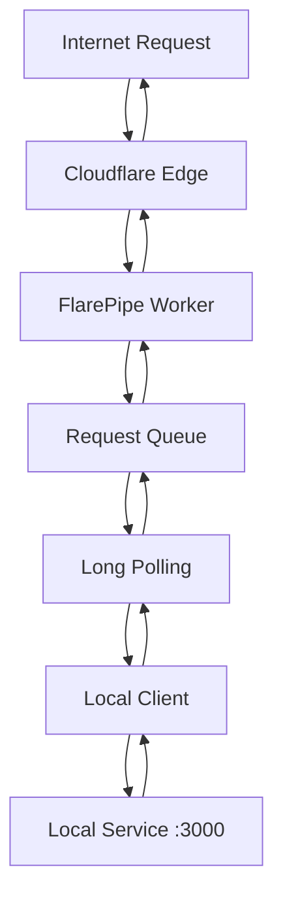

# FlarePipe 🔥

## What's new
In the v2.0.0 Flarepipe started to using Durable Objects for the best consistency


High-performance HTTP tunnel service built on Cloudflare Workers. Securely expose your local development servers to the internet through Cloudflare's global edge network.

## What is FlarePipe?

FlarePipe is a modern alternative to ngrok that leverages Cloudflare Workers for global, fast, and reliable HTTP tunneling. Perfect for:

- **Local Development** - Test webhooks, APIs, and web apps from anywhere
- **Team Collaboration** - Share development servers with teammates
- **Microservices** - Expose multiple services through different paths
- **IoT & Edge** - Connect devices behind firewalls to the internet

### Key Features

✨ **Global Edge Network** - Deployed to 300+ Cloudflare locations worldwide  
⚡ **High Performance** - Sub-200ms latency in most regions  
🔒 **Secure by Default** - HTTPS encryption and authentication  
🎯 **Multi-Service** - Route different paths to different local ports  
📊 **Scalable** - Handle high traffic with built-in load balancing  
🌍 **Free to Deploy** - Uses Cloudflare's generous free tier  

## Quick Start

### 1. Deploy the Server

```bash
# Clone the repository
git clone https://github.com/bgrusnak/flarepipe.git
cd flarepipe/server

# Install dependencies
npm install

# Configure authentication
npm run secret:auth
# Enter: your-secure-auth-key

# Deploy to Cloudflare
npm run deploy
```

Your tunnel server is now live at `https://your-worker.your-subdomain.workers.dev`

### 2. Install the Client

```bash
# Install globally
npm install -g flarepipe-client

# Or use directly with npx
npx flarepipe-client --help
```

### 3. Start Tunneling

```bash
# Basic usage - tunnel localhost:3000 to the internet
ft --host your-worker.your-subdomain.workers.dev \
   --auth your-secure-auth-key \
   --forward 3000

# Multi-service setup
ft --host your-worker.your-subdomain.workers.dev \
   --auth your-secure-auth-key \
   --forward 3000:/api \
   --forward 8080:/admin \
   --forward 5000:/websocket
```

## Architecture



FlarePipe uses a **queue-based architecture** for maximum reliability:

1. **Public requests** arrive at Cloudflare Workers
2. **Requests are queued** in memory with unique IDs
3. **Client polls** for new requests using long-polling
4. **Local proxy** forwards requests to your services
5. **Responses** are sent back through the tunnel

This design ensures zero lost requests and handles network interruptions gracefully.

## Project Structure

```
flarepipe/
├── server/                 # Cloudflare Worker (tunnel server)
│   ├── src/
│   │   ├── index.js        # Main worker entry point
│   │   ├── tunnel-manager.js # Tunnel lifecycle management
│   │   ├── request-queue.js # Request buffering & polling  
│   │   └── utils/
│   ├── wrangler.toml       # Cloudflare Worker configuration
│   └── package.json
│
├── client/                 # Node.js client (local tunnel)
│   ├── src/
│   │   ├── client.js       # Main tunnel client
│   │   ├── poller.js       # Server polling logic
│   │   ├── worker-pool.js  # Concurrent request processing
│   │   ├── cli.js          # Command line interface
│   │   └── utils/
│   ├── bin/ft.js          # Executable script
│   └── package.json
│
└── README.md              # This file
```

## Use Cases

### Web Development

```bash
# React development server
ft --host tunnel.example.com --auth key123 --forward 3000 --open

# API testing with webhooks
ft --host tunnel.example.com --auth key123 --forward 8000:/webhooks
```

### Microservices Development

```bash
# Multiple services on different paths
ft --host tunnel.example.com --auth key123 \
   --forward 3001:/auth \
   --forward 3002:/payments \
   --forward 3003:/notifications \
   --forward 3000           # Catch-all for frontend
```

### Team Collaboration

```bash
# Share your local environment
ft --host team-tunnel.example.com --auth shared-key \
   --forward 3000 --prefix dev/john
# Team accesses: https://team-tunnel.example.com/dev/john/*
```

### IoT and Edge Computing

```bash
# Expose device API to cloud
ft --host iot-gateway.example.com --auth device-key-123 \
   --forward 8080:/api/sensors \
   --local-host 192.168.1.100
```

## Configuration

### Server Configuration

Set these secrets in your Cloudflare Worker:

```bash
# Required: Authentication key for clients
wrangler secret put AUTH_KEY --env production

# Optional: URL prefix to avoid route conflicts
wrangler secret put PREFIX --env production
```

### Client Configuration

**Command line:**
```bash
ft --host worker.dev --auth key123 --forward 3000:/api --concurrency 32
```

**Configuration file (tunnel.yaml):**
```yaml
host: your-worker.your-subdomain.workers.dev
auth: your-secure-auth-key
prefix: tunnel
forward:
  - "3000:/api"
  - "8080:/admin" 
  - 5000
concurrency: 32
localHost: 127.0.0.1
open: true
```

## Performance & Limits

### Cloudflare Worker Limits
- **Request timeout:** 50ms CPU time (up to 5min with paid plans)
- **Memory:** 128MB per request
- **Request size:** 100MB maximum
- **Daily requests:** 100,000 (free tier)

### FlarePipe Limits
- **Concurrent tunnels:** Unlimited (memory permitting)
- **Queue size:** 100 requests per tunnel
- **Request timeout:** 30 seconds
- **Binary uploads:** 10MB maximum
- **Tunnel lifetime:** 10 minutes without heartbeat

### Performance Characteristics
- **Latency overhead:** ~50-200ms (varies by location)
- **Throughput:** Limited by origin server performance
- **Concurrency:** Up to 1000 requests per Worker instance
- **Global availability:** 300+ edge locations

## Advanced Features

### Load Balancing

```bash
# Run multiple clients for the same service
ft --host worker.dev --auth key123 --forward 3000:/api --concurrency 16
ft --host worker.dev --auth key123 --forward 3001:/api --concurrency 16
```

### Path-Based Routing

```bash
# Specific path routing with fallback
ft --host worker.dev --auth key123 \
   --forward 3001:/api/v1 \    # Most specific
   --forward 3002:/api \       # Less specific  
   --forward 3000              # Catch-all
```

### Binary File Support

FlarePipe automatically handles:
- Image uploads and downloads
- PDF and document transfers
- Video streaming (within size limits)
- ZIP and archive downloads

### Compression Support

```bash
# Enable compression for better performance
ft --host worker.dev --auth key123 --forward 3000 --enable-compression
```

## Security

### Authentication
- **Required auth key** for all tunnel operations
- **Bearer token authentication** for API endpoints
- **No data persistence** - requests only in memory

### Network Security
- **HTTPS-only** communication
- **Cloudflare WAF** protection against attacks
- **No logging** of request/response content
- **Automatic DDoS protection**

### Best Practices
- Use strong, randomly generated auth keys (32+ characters)
- Rotate auth keys regularly
- Use URL prefixes to avoid route conflicts
- Monitor tunnel activity for unusual patterns

## Monitoring & Debugging

### Built-in Monitoring

```bash
# View real-time logs
cd server && npm run tail

# Check tunnel status
curl -H "Authorization: Bearer your-key" \
  https://your-worker.workers.dev/tunnel/stats
```

### Client Status

```bash
# The client shows real-time statistics
✅ Tunnel is active and ready to receive requests
[12:34:56] Processed 5 requests (Total: 123, Success: 98.4%)
```

### Performance Monitoring

Monitor these metrics:
- Request success rate
- Average response time  
- Queue depth
- Active tunnel count
- Geographic distribution

## Troubleshooting

### Common Issues

**"Connection refused"**
- Verify local service is running on specified port
- Check firewall settings
- Ensure correct local-host configuration

**"Authentication failed"**
- Verify AUTH_KEY matches between server and client
- Check that auth key is at least 8 characters
- Ensure no extra spaces in auth key

**"High latency"**
- Check geographic distance to nearest Cloudflare edge
- Monitor local service response times
- Consider increasing client concurrency

### Getting Help

1. **Check the logs** - Both client and server provide detailed logging
2. **Verify configuration** - Ensure auth keys and URLs match
3. **Test with minimal setup** - Start with a simple single-port tunnel
4. **Monitor Cloudflare dashboard** - Check for errors or rate limiting

## Deployment Options

### Development
```bash
cd server && npm run dev      # Local development
cd client && npm run dev      # Client development
```

### Staging
```bash
cd server && npm run deploy:staging
```

### Production
```bash
cd server && npm run deploy
```

### Custom Domains

Configure a custom domain in Cloudflare:

1. Add your domain to Cloudflare
2. Create a Worker route: `tunnel.yourdomain.com/*`
3. Update client configuration to use your domain

## Comparison

| Feature | FlarePipe | ngrok | localtunnel |
|---------|-----------|-------|-------------|
| **Free tier** | ✅ Unlimited | ⚠️ Limited | ✅ Unlimited |
| **Custom domains** | ✅ Yes | ❌ Paid only | ❌ No |
| **Global edge** | ✅ 300+ locations | ⚠️ Limited | ⚠️ Limited |
| **Multiple ports** | ✅ Yes | ⚠️ Paid only | ❌ No |
| **Self-hosted** | ✅ Yes | ❌ No | ✅ Yes |
| **HTTPS** | ✅ Always | ✅ Yes | ✅ Yes |
| **File uploads** | ✅ 10MB | ✅ Yes | ⚠️ Limited |

## Contributing

We welcome contributions! Please see:
- **Issues** - Report bugs or request features
- **Pull Requests** - Submit code improvements
- **Documentation** - Help improve our docs

### Development Setup

```bash
# Clone the repository
git clone https://github.com/bgrusnak/flarepipe.git
cd flarepipe

# Server development
cd server
npm install
npm run dev

# Client development  
cd ../client
npm install
npm run dev
```

## License

MIT License - see [LICENSE](LICENSE.md) file for details.

## Links

- **Documentation:** [docs.flarepipe.dev](https://github.com/bgrusnak/flarepipe/wiki)
- **GitHub:** [github.com/bgrusnak/flarepipe](https://github.com/bgrusnak/flarepipe)
- **Issues:** [Report bugs](https://github.com/bgrusnak/flarepipe/issues)
- **Cloudflare Workers:** [developers.cloudflare.com/workers](https://developers.cloudflare.com/workers/)

---

**Made with ❤️ for the developer community**

*FlarePipe is not affiliated with Cloudflare Inc. Cloudflare is a trademark of Cloudflare Inc.*